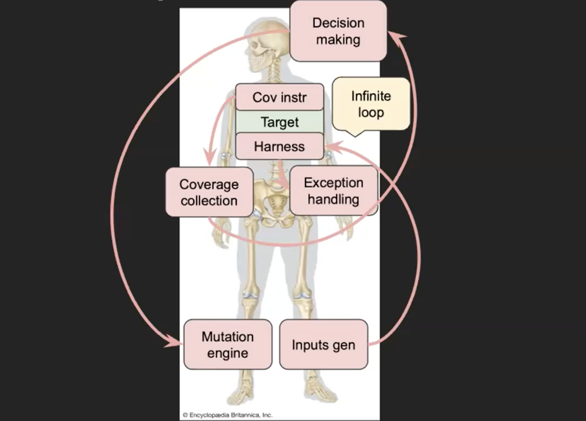

# Architecture

A coverage-guided fuzzer is a loop: generate an input, run the target under instrumentation,
observe (coverage + oracle), feed the observation back into generation. This project supplies the
format-aware generation and the learning scheduler; it inherits the loop, coverage, and crash
handling from **Jackalope** (fuzzing engine) and **TinyInst** (dynamic binary instrumentation).



## parser-aware

.lnk files follow the MS-SHLLINK format, which is highly stateful.
A byte-level mutator would not satisfy thr many state-based conditions, such as:
. `0x4C` header
. 16-byte `LNK_CLSID`
. ExtraData block signatures (`0xA00000xx`)
. `0x53505331` property-store version
. length and offset fields that must agree
Random bit-flips would spend all of their energy producing inputs the parser rejects in the first few hundred bytes.

This fuzzer parses the seed into a model, mutates *fields and structure* (offsets, sizes,
flags, PIDL item types, ExtraData ordering, property-value VARTYPEs), then reserializes;
recomputing the `0x4C` header, signatures, and lengths so the result re-enters the parser at a deep state
instead of at the header. Which structural corruption to apply is chosen by a bandit that learns from
coverage ([scheduler.md](scheduler.md)).

## Data flow

```
seed .lnk ─▶ deserialize_lnk ─▶ LNKGeneratorState ─▶ mutate_apply ─▶ serialize_lnk ─▶ SHM
                (parse)            (typed model)       (TS scheduler    (rebuild magic/   │
                                                        picks+applies    sigs/lengths)    │
                                                        one operator)                     ▼
                                                                            harness.exe drives
                                                                            shell32 / msi parse
            mutate_report ◀── has_new_coverage ◀── TinyInst coverage + oracles ◀──────────┘
            (update Beta
             posteriors)
```

One pass per mutation; `InitRound` parses the seed once and caches the state, then `Mutate` is
called many times against the cached model. `NotifyResult` forwards Jackalope's per-iteration
coverage verdict to the scheduler.

## Components

| file | role |
|---|---|
| [`model.h`](../model.h)            | typed LNK model — section structs, `ItemIDType`, enums, layouts |
| [`deserialize.c`](../deserialize.c)| raw bytes → `LNKGeneratorState` |
| [`mutate.c`](../mutate.c) / [`mutate.h`](../mutate.h) | ~85 structure-aware operators in 15 groups + the two-level Thompson Sampling scheduler |
| [`serialize.c`](../serialize.c)    | `LNKGeneratorState` → raw bytes (recomputes magic, signatures, lengths) |
| [`lnk_prng.c`](../lnk_prng.c) / `.h`| xoroshiro128++ / splitmix64, per-thread ([prng.md](prng.md)) |
| [`gen.c`](../gen.c)                | from-scratch valid-state generators (seed synthesis) |
| [`clsids.h`](../clsids.h)          | 143 IShellFolder CLSIDs enumerated from the registry, for PIDL injection |
| [`oracle.h`](../oracle.h)          | behavioral sink oracle, shared by both harnesses ([oracles.md](oracles.md)) |
| [`harness.cpp`](../harness.cpp)    | shell32 target — `IPersistStream::Load` → `Resolve` → full `IShellLinkW` surface |
| [`harness_darwin.cpp`](../harness_darwin.cpp) | msi.dll target — `MsiGetShortcutTargetW` / `CommandLineFromMsiDescriptor` |
| [`lnk_mutator.cc`](../lnk_mutator.cc) | Jackalope `Mutator` adapter — deserialize → `mutate_apply` → serialize, `NotifyResult` → `mutate_report` |
| [`lnk_prng_jackalope.cc`](../lnk_prng_jackalope.cc) | Jackalope `PRNG` adapter over xoroshiro |
| [`lnk_fuzzer_main.cc`](../lnk_fuzzer_main.cc) | `Fuzzer` subclass — wires the custom PRNG + mutator; produces `lnk_fuzzer.exe` |

## Boundaries

- **Engine vs. format.** Jackalope owns sample queueing, crash dedup, the worker loop, and the
  client/server distribution model. This project overrides only `CreatePRNG` and `CreateMutator`
  and provides the C core. No Jackalope source is modified, so upstream stays pullable.
- **Instrumentation is per-module.** TinyInst instruments exactly one module per run, so shell32 and
  msi are separate campaigns with separate corpora and separate scheduler posteriors. See
  [oracles.md](oracles.md#do-i-need-more-than-one-harness).
- **Coverage feedback comes from the target, not the harness.** TinyInst instruments shell32.dll /
  msi.dll; the harness's SHM/COM/loop scaffolding runs identically every iteration and carries zero
  scheduler signal, by design.

## Persistent mode

`fuzz()` is the persistent target: TinyInst rewrites its `RET` so each call loops back to entry
instead of returning, and `-iterations` bounds loops before the process is recycled to cap heap
growth in shell32's internal caches. COM objects are created and released per iteration so state
doesn't bleed across samples.
