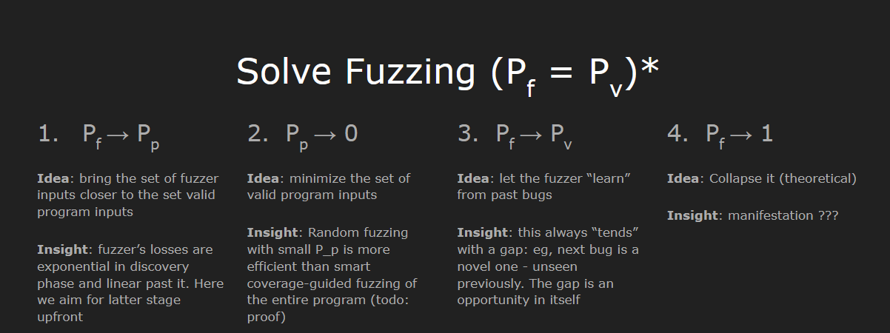

1. Success via stateful design; all generated inputs maintain a mutatable shell link format, and specific mutations are only carried out if the required preconditions have been satisfied.

2. Success via attack vector prioritization; inptus can programatically satisfy all their required preconditions in order to reach an interesting state. In this case, the fuzzer does not bother with earlier code paths (they are explorered over time anyway), rather, it preemptively focuses on a specific interesting path to explore. In such a way, unimportant paths are omitted for the timebeing, therefore minimizing the probability distribution of the program ($P_p$).

    Additionally, the Thompson Sampling scheduler deprioritizes unproductive operators automatically and separates dead from saturated, meaning unsuccessful inputs gate paths in a way that provides insight about the structural preconditions that are required (and have not been met) in order to discover deeper paths. This is more optimal in practice than removing boring operators.

